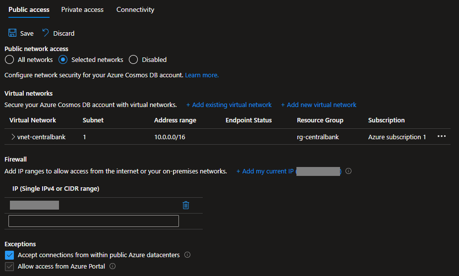

# Azure Cosmos security

Security features for Cosmos DB.

Set up the variables:

```sh
cp config/template.tfvars .auto.tfvars
```

Set your IP address in `cosmos_ip_range_filter`.

Create the resources:

```sh
terraform init
terraform apply -auto-approve
```

Use the client in the `/client` directory to send data to Cosmos.

Create the `.env` file:

```sh
COSMOS_ENDPOINT="https://<COSMOS NAME>.documents.azure.com:443/"
```

Run the client:

```sh
go get
go run .
```

For the NoSQL distribution there are only two [built-in role definitions][1]:

- `Cosmos DB Built-in Data Reader`
- `Cosmos DB Built-in Data Contributor`

Other security features will be described below.

The database will created with CMK:


Log collection is enabled:


Network IP filtering:



---

### Destroy

```sh
terraform destroy -auto-approve
```

[1]: https://learn.microsoft.com/en-us/azure/cosmos-db/how-to-setup-rbac#built-in-role-definitions
